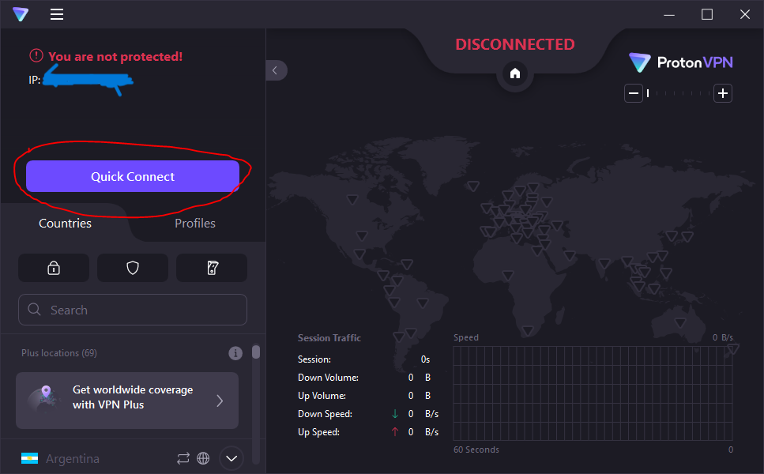

<h1> Virtual Private network deployment and Use </h1>
This is a tutorial on how to setup and use a virtual private network (VPN) using Proton VPN's free version on with the windows 10 OS.

<h2>Software necessary for operation </h2>

- Proton VPN

<h3>Installation </h3>

- Go to the Proton VPN website through your prefered search engine or using this url (https://protonvpn.com)

- Use the menu bar in the top right corner to show the side menu and click create account

- Click the Proton free and continue with free in the pop-up window

- Go back to the menu bar and click download

- Click the VPN for windows button  

- Click the Download Proton VPN and save it to the file location of your choosing

- Follow the instructions in the installer

- Open the proton VPN app and input your login information

- Click auto-connect to connect to a randon VPN Region

